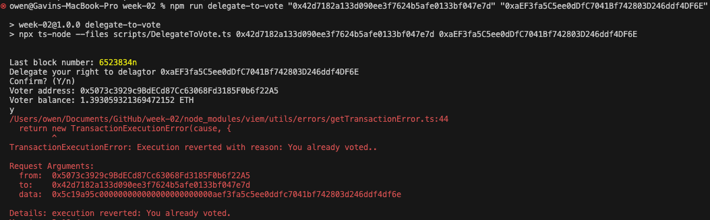

# Contract Interaction

## Scenario

### Rama/ErZeTe's interaction

1. Copied [Ballot.sol contract](../contracts/Ballot.sol) from Solidity docs and then compile it

2. Deploy the ballot contract using Viem with 3 proposals ["Cats", "Dogs", and "Rats"]. The contract address is `0x42d7182a133d090ee3f7624b5afe0133bf047e7d` with the transaction hash: [0xe1693be084f4907771637b6531b01500416b7b45c25c8f26505f6b8a14e73b18](https://sepolia.etherscan.io/tx/0xe1693be084f4907771637b6531b01500416b7b45c25c8f26505f6b8a14e73b18)
   

3. Run the [GiveVotingRight.ts](../scripts/GiveVotingRight.ts) script as the chairperson to give voting rights to all members of the team. With the following transactions hashes:

   - [0x901ac13e7d460567808dfc926bc8d36f46f403c83a632480f4e98213229532c9](https://sepolia.etherscan.io/tx/0x901ac13e7d460567808dfc926bc8d36f46f403c83a632480f4e98213229532c9)
   - [0x86d1e6e5159a996b276fab8dcfdb4206221edc029c48ab8fdee2c56cfe685b48](https://sepolia.etherscan.io/tx/0x86d1e6e5159a996b276fab8dcfdb4206221edc029c48ab8fdee2c56cfe685b48)
   - [0x9efdb03860097d5f685aa92c5d3bb0336b7383768d5a2cbe8a682fe6bf42dc8a](https://sepolia.etherscan.io/tx/0x9efdb03860097d5f685aa92c5d3bb0336b7383768d5a2cbe8a682fe6bf42dc8a)
   - [0x820554b844a9a0614cea07c1e8955ba4741223f9ea64ac4dcf6d61a588ed8d96](https://sepolia.etherscan.io/tx/0x820554b844a9a0614cea07c1e8955ba4741223f9ea64ac4dcf6d61a588ed8d96)

   

4. Run the [CastVote.ts](../scripts/CastVote.ts) script to cast my vote to proposal with the index 1.
   Transaction hash: [0x60ef332c53e5ddf40ca33865b6647e525107a235a4d5dca4fdb115905136be01](https://sepolia.etherscan.io/tx/0x60ef332c53e5ddf40ca33865b6647e525107a235a4d5dca4fdb115905136be01)
   

5. Run the [CheckTheWinnerName.ts](../scripts/CheckTheWinnerName.ts) script to see the current proposal winner after I casted my vote.
   

### Vins' interaction

1. Add script for executing from package.json 

2. Run `npm run cast-vote 0x42D7182A133D090eE3F7624B5AFE0133bF047e7D 0` and `npm run cast-vote 0x42D7182A133D090eE3F7624B5AFE0133bF047e7D 1` both resulting error  

3. Debugging the code and turns out there is a missing `0x` for the deployer account ![]<Screenshot 2024-08-18 at 10.10.33.png>

4. Update the voter into walletClient directly from [helpers/client.ts](../helpers/client.ts#L16)

5. Re-run `npm run cast-vote 0x42D7182A133D090eE3F7624B5AFE0133bF047e7D 0` and successful 

6. Try to delegate to `0xaEF3fa5C5ee0dDfC7041Bf742803D246ddf4DF6E` but got error (expected) 

7. Check the winning proposal 

### Tianbuyung's interaction

1. Check my right using `npm run check-voter-right "0x42d7182a133d090ee3f7624b5afe0133bf047e7d" "0xaEF3fa5C5ee0dDfC7041Bf742803D246ddf4DF6E"`
   

2. I have 1 power to vote because Vins delegate his right to me. So, I need to check the proposal using `npm run check-proposal-by-index "0x42d7182a133d090ee3f7624b5afe0133bf047e7d" "0" "1" "2"`
   

3. I vote the `"Cats" (index 0)`, so I run `npm run cast-vote "0x42d7182a133d090ee3f7624b5afe0133bf047e7d" "0"`
   

4. Check the winning proposal and the winner name with `npm run check-winning-proposal "0x42d7182a133d090ee3f7624b5afe0133bf047e7d" && npm run check-winner-name "0x42d7182a133d090ee3f7624b5afe0133bf047e7d"`
   

### Joosh75's interaction

1. I start by checking my voting right:
npm run check-voter-right "0x42d7182a133d090ee3f7624b5afe0133bf047e7d" "0x62cA7B13a0f7F3B4f55aAd7968aD0a78ea2d625C"
2. I Check to see the status of the votes.
npm run check-proposal-by-index "0x42d7182a133d090ee3f7624b5afe0133bf047e7d" "0" "1" "2"
I see that Cats and Dogs both have 2.
3. i decide to vote for Rats to show them some love:
npm run cast-vote "0x42d7182a133d090ee3f7624b5afe0133bf047e7d" "2"
transaction hash:
0xb24664fd59cefcf261337184e326249130435c492f9187da02b42a781fa9e24b
4. npm run check-winning-proposal "0x42d7182a133d090ee3f7624b5afe0133bf047e7d" && npm run check-winner-name "0x42d7182a133d090ee3f7624b5afe0133bf047e7d"

### 0xOwenn's / GavinOwen interaction

1. I check my voting rights using `npm run check-voter-right` 

2. Looks that i have 1 voting right, i used it to vote dog using `npm run cast-vote` , since it is my favourite animal! 

3. Checking current vote amount using `npm run check-proposal-by-index ` and we can see that dogs and cats have the same vote amount 

4. I tried to delegate my vote to `0xaEF3fa5C5ee0dDfC7041Bf742803D246ddf4DF6E` using `npm run delegate-to-vote` but transaction reverted, because i already voted. 

### RajRao10's interaction

1. I start by checking my voting right:
npm run check-voter-right "0x42d7182a133d090ee3f7624b5afe0133bf047e7d" "0x5Ee9CaD768760cdAEC9B8B55E4230cEC0B792c3a"

Shows the below result
---
Weight: 0
Has voted: false

2. I Check to see the status of the votes.
npm run check-proposal-by-index "0x42d7182a133d090ee3f7624b5afe0133bf047e7d" "0" "1" "2"
I see that Cats and Dogs both have 2. But, Rats have less votes.

3. i decide to vote for Rats to make them equal to Cats and Dogs:
npm run cast-vote "0x42d7182a133d090ee3f7624b5afe0133bf047e7d" "2"

Transaction got reverted with the below error:
"TransactionExecutionError: Execution reverted with reason: Has no right to vote."

4. npm run check-winning-proposal "0x42d7182a133d090ee3f7624b5afe0133bf047e7d" && npm run check-winner-name "0x42d7182a133d090ee3f7624b5afe0133bf047e7d"
